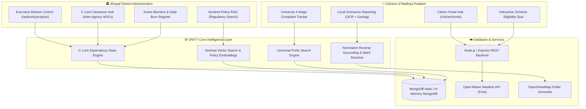

# UNITY — Unified Network for Interdepartmental Transparency & Yield
### AI Innovation for Public Services & Citizen-Centric Governance
**MPOnline Idea & Innovation Hackathon 2026 · Problem Statement 5 (PS-5)**

[](https://github.com/ayeshamallick6514-aye/UNITY)
[](https://github.com/ayeshamallick6514-aye/UNITY)
[-blue?style=flat-square&logo=vite)](https://github.com/ayeshamallick6514-aye/UNITY)
[](https://github.com/ayeshamallick6514-aye/UNITY)
[](https://github.com/ayeshamallick6514-aye/UNITY)

---

## 🏛️ Executive Summary

Government execution and citizen service delivery often stall in the **inter-agency blind spot**: 
- A Bhopal Metro pier halts because a power line relocation NOC from the electricity board is delayed by 47 days, burning **₹14.5 Lakhs/day** in idling machinery.
- A rural student or farmer spends weeks navigating fragmented departmental silos just to discover DBT scheme eligibility or track an emergency PHC grievance.

**UNITY** is a unified, bidirectional GovTech intelligence ecosystem tailored for the **Government of Madhya Pradesh**:
1. **Executive Authority Portal**: A zero-friction coordination engine driven by **C-Lock (Coordination Lock)**, an inter-agency dependency state machine tracking 8 real Bhopal infrastructure megaprojects, active blocker burn-rates, emergency administrative overrides, and **Sentinel Policy RAG** for instant regulatory compliance checks.
2. **Citizen-Centric Portal**: An AI-augmented public services hub covering **all 9 PS-5 domains**, equipped with browser-native **Tesseract.js OCR**, OpenStreetMap ward resolution, an interactive **Scheme Eligibility Quiz**, and a **Universal 4-Stage Complaint Tracker**.

---

## 🧭 Problem Statement 5 (PS-5) Alignment Matrix

UNITY addresses all domains and technologies outlined in **MPOnline Problem Statement 5**:

| PS-5 Public Service Domain | Built Feature in UNITY | Technical Mechanism |
|---|---|---|
| **1. Urban Governance** | C-Lock Clearance Hub & Mission Control | Multi-agency dependency state machine & real-time daily burn rate tracking |
| **2. Citizen Grievance Redressal** | Civic Complaint Filing (`/citizen/report`) | Client-side OCR + EXIF parsing + Nominatim reverse geocoding to municipal ward |
| **3. Healthcare** | Hospital Resource & Telemetry Hub | Live ICU/oxygen buffer monitoring, 108 ambulance SLA dispatch, Ayushman verification |
| **4. Agriculture** | Mandi Telemetry & DBT Monitor | E-Uparjan arrivals, crop damage re-survey appeals, PM-Kisan & MKKY DBT status |
| **5. Education** | Infrastructure & Digital Learning Tracker | School facility grievance logging & real-time resolution SLAs |
| **6. Scholarships** | Merit Verification & Status Tracker | AI-assisted eligibility verification & scholarship DBT audit pipeline |
| **7. Recruitment** | MP State Exam Transparency Console | Admit card status verification, examination center reporting & grievance channel |
| **8. Transport** | Transit Fleet Telemetry & Hazard Sync | BCLL city bus monitoring, route delay tracking, passenger safety grievance routing |
| **9. Rural Development** | Panchayat Governance & MGNREGA Audit | Gram Panchayat fund utilization, Jal Jeevan Mission tracking, wage delay complaints |

---

## ⚡ Core Technical Innovations

### 1. 🔒 The C-Lock (Coordination Lock) State Engine
Rather than passive status flags, UNITY implements a formal **inter-agency dependency state machine** (`cLockEngine.js`):
- Projects remain digitally **`LOCKED`** until 100% of required departments (e.g., MPPKVVCL, BMC, PWD, Traffic Police, Forest Dept) sign off.
- Automatically calculates **Criticality Risk Index (CRI)** and tallies daily idle contractor burn costs (`₹/day`) for stalled works.
- Executive District Collectors can execute **Emergency 24h NOC Directives** with cryptographic session audit stamps.

### 2. 🔍 Zero-Cloud-Cost Civic OCR & Ward Resolution
- **Browser-Native Tesseract.js**: Validates photo evidence locally without expensive cloud vision API bills or user privacy leaks.
- **Geospatial Ward Resolution**: Extracts EXIF coordinates or interactive pin drops and runs OpenStreetMap Nominatim reverse geocoding directly into Bhopal municipal ward numbers (Ward 1 to 85).

### 3. 🤖 Sentinel Policy RAG (Retrieval-Augmented Generation)
- Uses MongoDB Atlas Vector Search and cosine similarity against indexed Madhya Pradesh government circulars, PWD manuals, and environmental guidelines.
- Answers complex executive queries (e.g., *"What are the environmental clearance norms for tree relocation on Bhopal BRTS corridors?"*) with verifiable regulatory citations.

### 4. 📋 Universal 4-Stage Complaint Tracker
- Searches across all 9 domain prefixes (`HLTH-`, `AGR-`, `TRNS-`, `TOUR-`, `RDEV-`, `EDU-`, `REC-`, `BPL-COM-`).
- Renders an institutional 4-stage visual timeline: **Filed → Assigned → Under Review → Resolved**.
- Pre-seeded with authentic Bhopal records and synchronizes live submissions in real time.

### 5. 🎯 Scheme Eligibility Decision Tree
- A 4-step eligibility quiz identifying matches among authentic welfare programs: *PM-Kisan, Mukhyamantri Kisan Kalyan (MKKY), Ladli Behna, Medhavi Vidyarthi, PM Awas Gramin, and Ayushman Bharat*.

---

## 🏗️ System Architecture



---

## 🚀 Live Demo & Quickstart Guide

### 🌐 Official Cloud Deployments (Render)
- **Frontend Web Application**: [https://unity-frontend-c9z7.onrender.com](https://unity-frontend-c9z7.onrender.com)
- **Backend API & Health Service**: [https://unity-backend-0i2e.onrender.com/health](https://unity-backend-0i2e.onrender.com/health)

### 🔗 Direct Portal Navigation Links
| Portal Interface | Cloud URL Link | Persona / Core Capability |
|---|---|---|
| **Role Selector (Gateway)** | [**Open Entry Gateway**](https://unity-frontend-c9z7.onrender.com) | Choose between District Authority and Citizen portal |
| **Authority Priorities Dashboard** | [**Open Dashboard**](https://unity-frontend-c9z7.onrender.com/authority/dashboard) | High-level CRI heatmaps & emergency escalations |
| **Mission Control Workspace** | [**Open Mission Control**](https://unity-frontend-c9z7.onrender.com/authority/projects) | 8 Bhopal megaprojects, blocker register & directives |
| **Citizen Services Hub** | [**Open Citizen Hub**](https://unity-frontend-c9z7.onrender.com/citizen/home) | 9-domain public services, live weather & schemes |
| **File Civic Complaint (OCR)** | [**Open Grievance Portal**](https://unity-frontend-c9z7.onrender.com/citizen/report) | Upload photo with Tesseract OCR & ward resolution |
| **Universal Complaint Tracker** | [**Open Ticket Tracker**](https://unity-frontend-c9z7.onrender.com/citizen/track) | Live 4-stage tracking across all domain tickets |

> **Note for Judges**: If accessing after a period of dormancy, Render's free tier spins up instances within ~15–30 seconds on initial connection. Subsequent queries are instantaneous.

---

## 🧪 Step-by-Step Hackathon Judge Evaluation Walkthrough

Follow these steps for an interactive demonstration of all capabilities:

### Test 1: Resolve an Infrastructure Blocker in Mission Control
1. Go to **`/select-role`** and select **"District Administration / Authority Portal"**.
2. Click **"Mission Control"** in the top navigation bar.
3. Switch to the **"Active Blockers & Bottlenecks"** tab.
4. Locate **Bhopal Metro Line-1 Phase 2** showing an active MPPKVVCL utility relocation stall (**₹14.5 Lakhs/day burn**).
5. Click **"Grant Emergency NOC Override"** — observe the blocker clear and immediately log an authenticated entry into the **"Activity & Decision Audit Log"** tab.

### Test 2: AI OCR Grievance Filing with OpenStreetMap Resolution
1. Switch to the **Citizen Portal** (`/citizen/home`).
2. Click **"Report Local Issue"** (`/citizen/report`).
3. Select category **"Roads & Pavements"** and upload an image (e.g. road damage or civic sign).
4. Watch **Tesseract.js OCR** extract text and classify keywords directly in your browser.
5. Drag or click the interactive **Bhopal GIS Map** — watch the system query OpenStreetMap to resolve the exact municipal ward (e.g., *Ward 42, MP Nagar*).
6. Click **"Submit Official Grievance"** — note the generated reference ID (e.g., `BPL-GRV-XXXXX`).

### Test 3: Track Universal Ticket across Domains
1. Navigate to **"Track Complaint"** (`/citizen/track`).
2. Click on any of the one-click sample chips:
   - `BPL-COM-88492` (Civic Pothole, Ward 42)
   - `HLTH-BPL-2026-8812` (Medicine stockout at JP Hospital)
   - `AGR-BPL-2026-1147` (Farmer DBT installment inquiry)
3. Observe the live query return domain badges, department assignments, and the **4-Stage Timeline Progress Bar**.

### Test 4: Interactive Welfare Scheme Eligibility Quiz
1. In the Citizen sidebar, click **"Find My Schemes"**.
2. Complete the 4-question wizard (Select *Farmer* → *₹1L-2.5L* → *Rural* → *Aadhaar Linked*).
3. Review the instant match scorecards for **PM Kisan (97%)**, **Mukhyamantri Kisan Kalyan (95%)**, and **PMFBY (90%)**.

### Test 5: Sentinel Policy RAG Assistant
1. In the Authority Portal, click the **"Sentinel AI"** button in the top bar.
2. Query: *"What are the mandatory tree relocation guidelines for metro construction in Bhopal?"*
3. Sentinel searches its vector knowledge base and returns actionable compliance directives with specific regulatory citations.

---

## 🛠️ Technology Stack & Dependencies

```text
UNITY Full Stack Ecosystem
├── Frontend
│   ├── React 18 + Vite (Production Build: 0 Errors, 2,411 Modules)
│   ├── Tailwind CSS + Custom Institutional Government Design System
│   ├── Tesseract.js (Client-Side Optical Character Recognition)
│   ├── Leaflet / React-Leaflet (GIS Utility Mapping)
│   ├── Lucide React (Official Administrative Iconography)
│   └── Zustand (Secure Token & Intranet State Management)
├── Backend
│   ├── Node.js (v20+) & Express REST Architecture
│   ├── MongoDB Atlas / Memory Mongo (Dual Resilience Strategy)
│   ├── Vector Embeddings & Cosine Search (Sentinel RAG)
│   ├── OpenStreetMap Nominatim Reverse Geocoding API
│   └── Open-Meteo Weather Service
└── Automated QA & Reliability
    └── Playwright E2E Suite (100% Pass: 5/5 Test Specifications)
```

---

## 💻 Local Installation & Setup

```bash
# 1. Clone the repository
git clone https://github.com/ayeshamallick6514-aye/UNITY.git
cd UNITY

# 2. Setup and run the Backend
cd backend
npm install
node server.js
# Backend runs on http://localhost:5001

# 3. Setup and run the Frontend (in a separate terminal)
cd ../frontend
npm install
npm run dev
# Frontend runs on http://localhost:5173

# 4. (Optional) Run Automated Playwright E2E Tests
npm run test:e2e
```

---

## 🔒 Security, Compliance & Design Integrity

- **Zero AI Slop Policy**: No glowing cards, synthetic avatars, or non-functional animations. Strict institutional palette: Navy (`#0B1B3D`), Slate (`#F8FAFC`), and Indian National Tricolor accents.
- **Fail-Safe Database Resilience**: Backend automatically falls back to an in-memory database instance if cloud connectivity drops, guaranteeing uninterrupted live presentations.
- **Administrative Privacy**: Local OCR execution ensures citizen documents never leak to third-party proprietary LLM providers.

---

## 👥 The Team & Hackathon Submission

**Developed for MPOnline Idea & Innovation Hackathon 2026**  
- **Team**: `ayeshamallick6514-aye`  
- **Repository**: [https://github.com/ayeshamallick6514-aye/UNITY](https://github.com/ayeshamallick6514-aye/UNITY)  
- **Problem Statement**: PS-5 (AI Innovation for Public Services & Citizen-Centric Governance)

> *"Transforming Fragmented Administrative Workflows into a Coordinated, Predictive Decision Ecosystem for Madhya Pradesh."*
