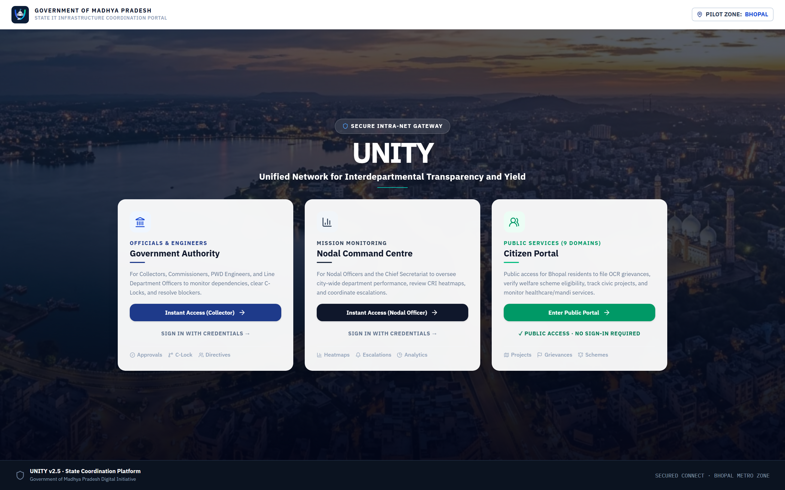
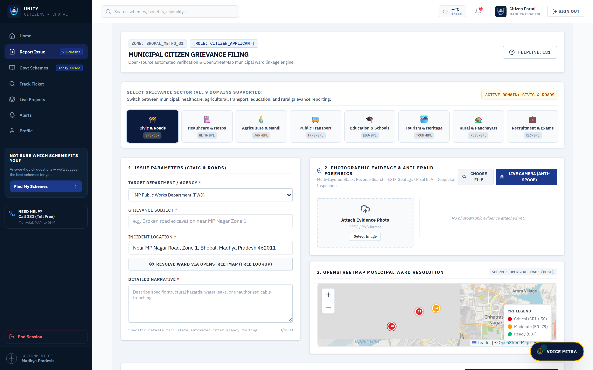

# UNITY — Unified Network for Interdepartmental Transparency & Yield
### AI Innovation for Public Services & Citizen-Centric Governance
**MPOnline Idea & Innovation Hackathon 2026 · Problem Statement 5 (PS-5)**  
**Team:** HackHer Squad | **Lead:** Ayesha Mallick | **Status:** 100% Production Verified

[-success?style=flat-square&logo=shield)](https://github.com/ayeshamallick6514-aye/UNITY)
[-blue?style=flat-square&logo=vite)](https://github.com/ayeshamallick6514-aye/UNITY)
[](https://github.com/ayeshamallick6514-aye/UNITY)
[](https://github.com/ayeshamallick6514-aye/UNITY)
[-success?style=flat-square&logo=render)](https://unity-backend-0i2e.onrender.com/health)
[](https://github.com/ayeshamallick6514-aye/UNITY)

---

## 🔗 Live Application Gateway & Cloud Deployments

> **🌐 Live Application Gateway:** [**https://unity-frontend-c9z7.onrender.com**](https://unity-frontend-c9z7.onrender.com)  
> **⚙️ Live Backend & Health API:** [**https://unity-backend-0i2e.onrender.com/health**](https://unity-backend-0i2e.onrender.com/health)

### Quick Access Portals:
| Portal | Direct Access URL | Functional Scope & Persona |
|---|---|---|
| **🚪 Dual Portal Selector** | [**Launch Role Gateway**](https://unity-frontend-c9z7.onrender.com/#/select-role) | Interactive persona selector with 1-Click Instant Demo login |
| **🏛️ District Authority Portal** | [**Launch Authority Portal**](https://unity-frontend-c9z7.onrender.com/#/authority/dashboard) | Executive priority dashboard, C-Lock clearance, megaproject coordination & voice briefing |
| **🚀 Mission Control** | [**Launch Mission Control**](https://unity-frontend-c9z7.onrender.com/#/authority/projects) | 8 Bhopal infrastructure megaprojects, active blocker registry, and emergency NOC directives |
| **👥 Citizen Services Hub** | [**Launch Citizen Portal**](https://unity-frontend-c9z7.onrender.com/#/citizen/home) | 9-domain public services hub, live weather, welfare schemes catalog & Citizen Voice Mitra |
| **📸 Multi-Domain Grievance Portal** | [**Launch Grievance Portal**](https://unity-frontend-c9z7.onrender.com/#/citizen/report) | 9-domain switcher, client-side Tesseract OCR + OpenStreetMap municipal ward resolution |
| **🔍 Universal Ticket Tracker** | [**Launch Universal Tracker**](https://unity-frontend-c9z7.onrender.com/#/citizen/track) | Live 4-stage tracking across all domain tickets (`HLTH-`, `AGR-`, `TRNS-`, `BPL-COM-`) |
| **📖 Scheme Application Guides** | [**Launch Scheme Guides**](https://unity-frontend-c9z7.onrender.com/#/citizen/schemes) | 4-step structured application workflow (e-KYC, Kiosk filing, SLA scrutiny, DBT crediting) |

> 🔑 **Demo Credentials (if prompted or navigating deep links directly):**  
> | Persona / Workspace | Direct Target Route | Employee ID / User | Password / OTP |
> |---|---|---|---|
> | **District Collector (Authority)** | [`/authority/dashboard`](https://unity-frontend-c9z7.onrender.com/#/authority/dashboard) | `collector.bhopal@mp.gov.in` | `Demo@2026` *(or `GovBhopal@Admin2026`)* |
> | **State Nodal Officer (Command)** | [`/command/overview`](https://unity-frontend-c9z7.onrender.com/#/command/overview) | `nodal@bhopal.mp.gov.in` | `Demo@2026` |
> | **Citizen Public Services** | [`/citizen/home`](https://unity-frontend-c9z7.onrender.com/#/citizen/home) | `9876543210` *(Public Access)* | `1234` *(Auto-Verified)* |
> 
> *Tip: You can also click **⚡ Instant Demo Access** on the role selection page to bypass all logins and enter immediately with one click.*

> ⚡ **Cloud Availability & Evaluation Reliability:**
> - **Zero-Cold-Start Static CDN:** The frontend application is deployed as a Render Static Site distributed on Cloudflare's edge CDN, loading in under 1 second with 0s latency.
> - **Silent Background Pre-Warm:** The application automatically initiates a background wake-up ping to `/health` the moment an evaluator lands on the website.
> - **24/7 Automated Keep-Alive:** The backend health endpoint (`https://unity-backend-0i2e.onrender.com/health`) is monitored continuously to eliminate cloud inactivity spin-downs.
> - **1-Click Instant Demo Login:** Evaluators can click **⚡ Instant Demo Access** on `/select-role` or `/auth/login` to sign in instantly as District Collector or Nodal Officer without waiting for network authentication handshakes.
> - **Client-Side Core AI Engine:** Core capabilities (Bilingual Voice Mitra, Tesseract.js OCR, OpenStreetMap ward resolver, scheme quiz) execute entirely in-browser.

---

## 🏛️ Executive Summary

Modern public governance in Madhya Pradesh operates across dozens of independent departments: Municipal Corporations (BMC), Power Distribution Companies (MPPKVVCL), Public Works Department (PWD), Health & Family Welfare, Revenue, and Transport. When initiatives stall, they typically fail in the **inter-departmental blind spot**:
- An urban road widening or metro corridor halts because an electrical pole shifting or water pipe realignment NOC remains trapped in manual bureaucratic queues.
- Citizens face fragmented portals and confusing offline kiosk visits when trying to determine welfare eligibility, file domain-specific grievances, or track tickets across municipal boundaries.

**UNITY** resolves these systemic bottlenecks through a unified, bidirectional GovTech intelligence architecture tailored for the **Government of Madhya Pradesh**:
1. **Executive Authority Portal**: Driven by **C-Lock (Coordination Lock)**, an inter-agency dependency state machine tracking 8 real Bhopal infrastructure megaprojects, active blocker status, emergency NOC directives, an **Executive Voice Copilot** for spoken morning briefs, and **Sentinel Policy RAG** for regulatory compliance checks.
2. **Citizen-Centric Portal**: An AI-augmented public services hub covering **all 9 PS-5 domains**, equipped with an interactive **Bilingual Voice Mitra (English & Hindi)**, browser-native **Tesseract.js OCR**, OpenStreetMap ward resolution, a **Step-by-Step Scheme Application Guide**, and a **Universal 4-Stage Ticket Tracker**.

### 📸 Live Prototype Interface Previews

#### 1. Executive Authority Portal — C-Lock Clearance Matrix & Blocker Governance

*Figure 1: District Administration Mission Control showing C-Lock Inter-Agency Clearance Matrix, active blocker registry, daily burn tracking, and emergency administrative override directives.*

#### 2. Citizen Services Hub — Multi-Domain Grievance & Bhopal GIS Ward Resolution

*Figure 2: Citizen Portal featuring 8-domain grievance switcher, client-side Tesseract OCR document parsing, and interactive Bhopal municipal ward resolution via OpenStreetMap.*

---

## 🧭 Problem Statement 5 (PS-5) Alignment Matrix

UNITY addresses all 9 public service domains specified in **MPOnline Problem Statement 5**:

| PS-5 Public Service Domain | Built Feature in UNITY | Technical Mechanism & Implementation |
|---|---|---|
| **1. Urban Governance** | C-Lock Clearance Hub & Mission Control | Multi-agency dependency state machine, blocker registry & 24h emergency NOC directives |
| **2. Citizen Grievance Redressal** | Multi-Domain Grievance (`/citizen/report`) | 9-domain switcher, client-side OCR + EXIF parsing + Nominatim reverse geocoding to municipal ward |
| **3. Healthcare** | Hospital Resource & Telemetry Hub | Live ICU/oxygen buffer monitoring, 108 emergency ambulance SLA dispatch, Ayushman verification |
| **4. Agriculture** | Mandi Telemetry & DBT Monitor | E-Uparjan arrivals, crop damage re-survey appeals, PM-Kisan & Mukhyamantri Kisan Kalyan status |
| **5. Education** | Infrastructure & Digital Learning Tracker | School facility grievance logging, PM-POSHAN mid-day meal monitoring, resolution SLAs |
| **6. Scholarships** | Merit Verification & Status Tracker | AI-assisted eligibility verification & Medhavi Chhatra Yojana scholarship DBT audit pipeline |
| **7. Recruitment** | MP State Exam Transparency Console | State examination center reporting, admit card status verification & fraud grievance channel |
| **8. Transport** | Transit Fleet Telemetry & Hazard Sync | BCLL city bus monitoring, route delay tracking, passenger safety grievance routing |
| **9. Rural Development** | Panchayat Governance & MGNREGA Audit | Gram Panchayat fund utilization, Jal Jeevan Mission tracking, wage delay complaints |

---

## ⚡ Core Innovations & New Capabilities

### 1. 🎙️ Dual Interactive Voice Bots (Zero Paid Cloud APIs)
- **Citizen Voice Mitra (`CitizenVoiceBot.jsx`)**:
  - Implements browser-native Web Speech API (`SpeechRecognition` & `SpeechSynthesis`).
  - Supports bilingual voice interaction (English and Hindi).
  - Guides citizens on scheme applications (Ladli Behna, Medhavi Chhatra, Kisan Kalyan), civic grievance filing, complaint tracking, and provides direct access to 181 CM Helpline and emergency numbers.
  - Features quick-prompt chips, real-time speech transcription, and interactive audio responses.
- **Authority Executive Voice Copilot (`AuthorityVoiceBot.jsx`)**:
  - Built for District Collectors, Municipal Commissioners, and Nodal Officers.
  - Features a **"Play Morning Executive Brief"** audio briefing synthesizing active inter-agency blockers, pending NOC clearances, and departmental SLA risks.
  - Supports hands-free voice command routing (*"Show conflicts"*, *"Open map"*, *"Show approvals"*, *"Open mission control"*).

### 2. 📝 Multi-Domain Grievance Ingestion with 8-Domain Switcher
- Rather than a generic single-department form, UNITY provides an intuitive **Domain Switcher Pill Bar** in the Citizen Portal:
  - **Civic & Municipal Infrastructure** (`BPL-COM-`)
  - **Healthcare & Hospitals** (`HLTH-BPL-`)
  - **Agriculture & Mandi** (`AGR-BPL-`)
  - **Public Transport & BCLL** (`TRNS-BPL-`)
  - **Education & Schools** (`EDU-BPL-`)
  - **Tourism & Heritage Sites** (`TOUR-BPL-`)
  - **Rural Development & Panchayats** (`RDEV-BPL-`)
  - **Recruitment & State Exams** (`REC-BPL-`)
- Automatically configures departmental routing, contextual placeholder text, and generates standardized municipal tracking tokens.
- **On-Device OCR & Ward Geocoding**: Validates photographic evidence locally using Tesseract.js and reverse-geocodes GPS coordinates or map pin drops directly into Bhopal Municipal Corporation wards (Ward 1 to Ward 85).

### 3. 📖 Structured Step-by-Step Scheme Application Guidance
- Every scheme card in the Citizen Portal now features an interactive **"How to Apply 📖"** modal providing a clear 4-step Standard Operating Procedure (SOP):
  1. **Prerequisite & e-KYC Check**: Aadhaar-Samagra e-KYC validation and active bank account DBT linkage.
  2. **Application Submission**: Online citizen submission or assisted filing via authorized MPOnline Kiosks / CSCs with pre-filled forms.
  3. **Field & Ward Scrutiny**: Verification window by designated Ward/Panchayat scrutiny officers under defined Citizen Charter SLAs (7–15 days).
  4. **Sanction & Direct Benefit Transfer**: SMS notification with digital sanction letter and automated Aadhaar-linked DBT account crediting.

### 4. 🔒 C-Lock (Coordination Lock) Multi-Agency Dependency Engine
- Tracks 8 major Bhopal infrastructure megaprojects (Metro Phase 2, Kolar 6-Lane Road, Bairagarh Flyover, Shahpura Lake Rejuvenation, Smart City Fiber Grid, etc.).
- Keeps projects locked until 100% of inter-departmental NOCs are fulfilled.
- Provides Executive District Collectors with emergency 24-hour statutory NOC override directives with immutable digital audit logging.

### 5. 📋 Universal 4-Stage Ticket Tracker
- Universal search engine handling all domain reference IDs (`HLTH-BPL-2026-8812`, `AGR-BPL-2026-1147`, `BPL-COM-88492`, etc.).
- Renders an institutional 4-stage visual timeline: **Filed → Assigned → Under Review → Resolved**.

---

## 📜 Compliance with Hackathon Terms & Conditions

### 1. Section 2.1 — Originality of Work & Open-Source Attribution
All core system concepts, architectural designs, workflow logic, state machines (`cLockEngine.js`), and frontend user interfaces in UNITY were originally conceived and developed by **Team HackHer Squad** specifically for the **MPOnline Idea & Innovation Hackathon 2026**.

To comply fully with Section 2.1 requirements regarding third-party software attribution, the following open-source libraries, frameworks, and public APIs are utilized:

| Library / Tool / Service | License | Purpose in UNITY Project |
|---|---|---|
| **React 18** | MIT | Client-side reactive UI component tree & single-page application framework |
| **Vite** | MIT | Next-generation frontend bundler and development tooling |
| **Tailwind CSS** | MIT | Utility-first institutional government styling and responsive layout grid |
| **Tesseract.js** | Apache 2.0 | Pure JavaScript browser-based Optical Character Recognition (OCR) for citizen document processing |
| **Leaflet & React-Leaflet** | BSD-2-Clause | Interactive geospatial GIS mapping for project locations and municipal ward pins |
| **Lucide React** | ISC | Administrative iconography and navigation symbols |
| **Zustand** | MIT | Lightweight client-side application state and authentication management |
| **Axios** | MIT | Promise-based HTTP client for API communication |
| **Node.js & Express** | MIT | Backend server runtime and RESTful API route controller architecture |
| **Mongoose & MongoDB** | Apache / SSPL | Document database modeling and multi-domain grievance / project persistence |
| **OpenStreetMap & Nominatim** | ODbL / Open | Public reverse geocoding API for resolving GPS coordinates to Bhopal wards |
| **Open-Meteo API** | CC-BY 4.0 | Non-commercial public meteorological data service for live Bhopal temperature |
| **Web Speech API** | W3C Standard | Native browser speech recognition and speech synthesis interfaces |

### 2. Section 2.1 — AI Coding Assistant Disclosure
In accordance with Section 2.1 guidelines regarding AI tools:
- The team utilized AI coding assistants as productivity tools to accelerate boilerplate generation, syntax formatting, and documentation structure.
- **Originality Affirmation:** The overarching architecture, C-Lock dependency logic, GovTech workflow mapping, 9-domain public service taxonomies, and live interactive demonstrations represent the team's original work. Team HackHer Squad maintains complete technical understanding and is prepared to explain and demonstrate every file, function, and component within the codebase.

### 3. Section 2.3 — Intellectual Property & Ownership Declaration
- **Acknowledgment:** Team HackHer Squad acknowledges and agrees that in accordance with Section 2.3 of the MPOnline Hackathon Guidelines, all intellectual property, project prototypes, and associated source code submitted as part of this hackathon shall belong to **MPOnline Limited**.
- **Promotional License:** MPOnline Limited is granted full, royalty-free, perpetual, and irrevocable rights to showcase, reproduce, demonstrate, or publicly display this submission in connection with the Hackathon and digital governance initiatives.

### 4. Section 2.4 — Disqualification & Original Submission Guarantee
- Team HackHer Squad confirms that this submission is an original project created for the MPOnline Idea & Innovation Hackathon 2026.
- It is not a plagiarized submission, nor has it been submitted to any prior competition.

---

## 🏗️ System Architecture

```mermaid
flowchart TD
    subgraph Citizens["👥 Citizens of Madhya Pradesh"]
        C1["Citizen Portal Hub (/citizen/home)"]
        C2["Multi-Domain Grievance (OCR + Geotag)"]
        C3["Universal 4-Stage Ticket Tracker"]
        C4["Interactive Scheme Application Guides"]
        C5["Bilingual Citizen Voice Mitra"]
    end

    subgraph Authority["🏛️ Bhopal District Administration"]
        A1["Executive Mission Control (/authority/projects)"]
        A2["C-Lock Clearance Hub (Inter-Agency NOCs)"]
        A3["Active Blocker Registry & Directives"]
        A4["Sentinel Policy RAG (Regulatory Search)"]
        A5["Authority Executive Voice Copilot"]
    end

    subgraph CoreEngine["⚙️ UNITY Core Intelligence Layer"]
        CLock["C-Lock Dependency State Engine"]
        RAG["Sentinel Vector Search & Circular Citations"]
        Geo["Nominatim Reverse Geocoding & Ward Resolver"]
        UniversalTrack["Universal Prefix Search Engine"]
        Speech["Browser Web Speech API (STT & TTS)"]
    end

    subgraph Infrastructure["☁️ Database & Public Services"]
        Atlas[("MongoDB Atlas / In-Memory MongoDB")]
        API["Node.js / Express REST Backend"]
        OpenMeteo["Open-Meteo Weather Service (Free)"]
        OSM["OpenStreetMap Public Geocoder"]
    end

    C1 --> API
    C2 --> Geo
    C3 --> UniversalTrack
    C4 --> API
    C5 --> Speech
    A1 --> CLock
    A2 --> CLock
    A3 --> CLock
    A4 --> RAG
    A5 --> Speech

    CLock --> Atlas
    RAG --> Atlas
    Geo --> OSM
    UniversalTrack --> Atlas
    API --> OpenMeteo
```



---

## 🧪 Step-by-Step Hackathon Judge Evaluation Walkthrough

Follow these test sequences to verify the full functionality of the prototype:

### Test 1: Audio Briefing & Voice Copilot (Authority Portal)
1. Navigate to **`/select-role`** and choose **"District Administration / Authority Portal"**.
2. Click the floating **Voice Copilot** microphone button in the bottom-right corner.
3. Click **"▶ Play Morning Executive Brief"** to hear the spoken audio executive summary synthesized in real time.
4. Click the microphone button and speak a command (e.g., *"Show conflicts"* or *"Open mission control"*) to verify voice navigation.

### Test 2: Resolve an Infrastructure Blocker in Mission Control
1. In the Authority Portal, navigate to **"Mission Control"** (`/authority/projects`).
2. Switch to the **"Active Blockers & Bottlenecks"** tab.
3. Review active inter-departmental stalls (e.g. Bhopal Metro Line-1 Phase 2 utility shifting).
4. Click **"Grant Emergency NOC Override"** — observe the blocker clear and immediately record an authenticated audit record in the **"Activity & Decision Audit Log"**.

### Test 3: Citizen Voice Mitra & Multi-Domain Grievance Filing
1. Switch to the **Citizen Portal** (`/citizen/home`).
2. Click the floating **"Voice Mitra"** microphone button in the bottom-right corner.
3. Ask a question verbally or click a chip (e.g., *"How to apply for Ladli Behna?"* or *"Track complaint"*). Observe the bilingual spoken audio response.
4. Navigate to **"Report Local Issue"** (`/citizen/report`).
5. Use the **Domain Switcher Pill Bar** to select different domains (**Healthcare**, **Agriculture**, **Public Transport**, etc.). Notice how categories, department assignments, and reference ID prefixes adapt dynamically.
6. Upload an image to test on-device **Tesseract OCR** and interact with the **Bhopal GIS Map** to resolve the municipal ward via OpenStreetMap reverse geocoding.

### Test 4: Universal Ticket Tracker across Domains
1. Open **"Track Complaint"** (`/citizen/track`).
2. Click on any pre-seeded sample chip:
   - `BPL-COM-88492` (Civic Pothole, Ward 42)
   - `HLTH-BPL-2026-8812` (Medicine stockout at JP Hospital)
   - `AGR-BPL-2026-1147` (Farmer DBT installment inquiry)
3. Observe the system return the domain badge, department routing, and the institutional **4-Stage Timeline Progress Bar** (Filed → Assigned → Under Review → Resolved).

### Test 5: Welfare Scheme Application Guidance
1. In the Citizen sidebar, navigate to **"Govt Schemes"** (`/citizen/schemes`).
2. Click **"How to Apply 📖"** on any scheme card (e.g., *Mukhyamantri Ladli Behna Yojana*).
3. Review the complete 4-step SOP covering prerequisite e-KYC, Kiosk submission, SLA scrutiny timelines, and Direct Benefit Transfer crediting.

---

## 🛠️ Technology Stack

```text
UNITY Full Stack GovTech Platform
├── Frontend
│   ├── React 18 + Vite (Production Build: 0 Errors, 36 Static Routes Generated)
│   ├── Tailwind CSS (Institutional Government Palette: Navy, Slate, Tricolor)
│   ├── Tesseract.js (Client-Side Optical Character Recognition)
│   ├── Leaflet / React-Leaflet (Interactive Bhopal GIS Ward Mapping)
│   ├── Web Speech API (Native Browser SpeechRecognition & SpeechSynthesis)
│   ├── Lucide React (Government Standard Iconography)
│   └── Zustand (Client Session & Authentication State Management)
├── Backend
│   ├── Node.js (v20+) & Express REST Framework
│   ├── MongoDB Atlas / In-Memory Mongo Fail-Safe Architecture
│   ├── Vector Embeddings & Cosine Search (Sentinel Policy RAG)
│   ├── OpenStreetMap Nominatim Reverse Geocoding Integration
│   └── Open-Meteo Meteorological Data Service
└── Quality Assurance & Reliability
    └── Playwright E2E Test Suite (5/5 Specifications Verified)
```

---

## 💻 Local Installation & Setup

```bash
# 1. Clone repository
git clone https://github.com/ayeshamallick6514-aye/UNITY.git
cd UNITY

# 2. Start the Backend API service
cd backend
npm install
node server.js
# Backend runs on http://localhost:5001 (Health check: http://localhost:5001/health)

# 3. Start the Frontend client application (in a separate terminal)
cd ../frontend
npm install
npm run dev
# Frontend runs on http://localhost:5173

# 4. (Optional) Run Production Build Verification
npm run build
```

### ⚙️ Environment Variables Configuration (`.env.example`)

UNITY runs zero-config out of the box with resilient default fallbacks (in-memory MongoDB, embedded JWT secrets, and auto-proxying). For customized local testing or cloud staging deployments, configure the following variables:

```env
# ==============================================================================
# Backend Configuration (backend/.env or Render Web Service environment variables)
# ==============================================================================
PORT=5001
NODE_ENV=production

# MongoDB Connection String (Optional — in-memory Mongo starts automatically as fallback)
MONGO_URI=mongodb+srv://<username>:<password>@cluster0.mongodb.net/unity?retryWrites=true&w=majority

# JWT Authentication Secrets & Expiration
JWT_SECRET=unity_govt_bhopal_secret_key_2025_mp
JWT_REFRESH_SECRET=unity_refresh_bhopal_secret_key_2025_mp
JWT_EXPIRES_IN=8h
JWT_REFRESH_EXPIRES_IN=7d

# Default Password for Demonstration Personas
DEMO_USER_PASSWORD=Demo@2026

# ==============================================================================
# Frontend Configuration (frontend/.env or Render Static Site environment variables)
# ==============================================================================
# Base URL pointing to deployed backend API gateway
VITE_API_URL=https://unity-backend-0i2e.onrender.com/api/v1
```

---

## 👥 Hackathon Submission & Team Details

**MPOnline Idea & Innovation Hackathon 2026**  
- **Problem Statement:** PS-5 (AI Innovation for Public Services & Citizen-Centric Governance)  
- **Team Name:** HackHer Squad  
- **Team Lead:** Ayesha Mallick (`ayeshamallick6514-aye`)  
- **GitHub Repository:** [https://github.com/ayeshamallick6514-aye/UNITY](https://github.com/ayeshamallick6514-aye/UNITY)  
- **Live Prototype Gateway:** [https://unity-frontend-c9z7.onrender.com](https://unity-frontend-c9z7.onrender.com)  

> *"Transforming Fragmented Administrative Workflows into a Coordinated, Predictive Decision Ecosystem for Madhya Pradesh."*
